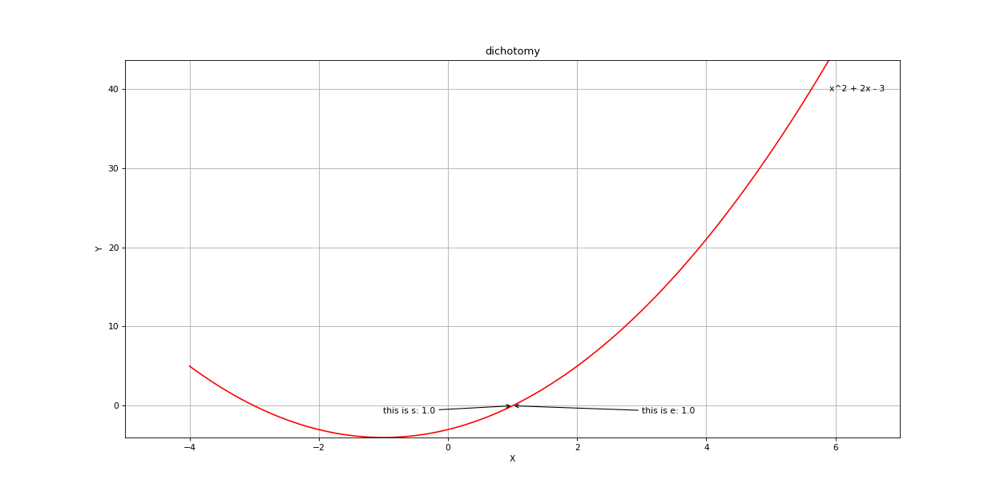
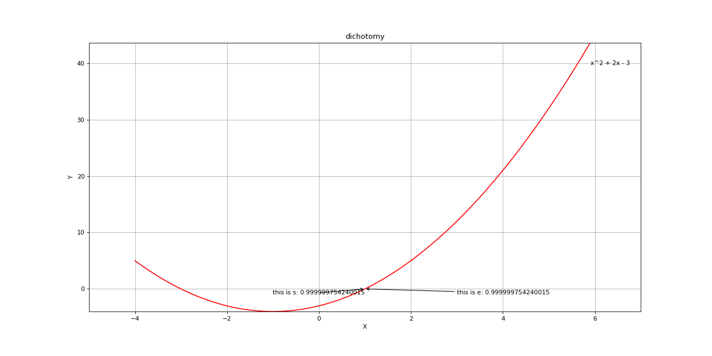
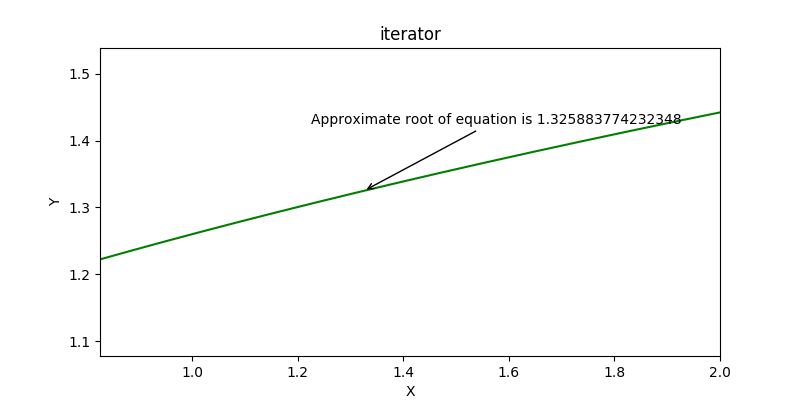
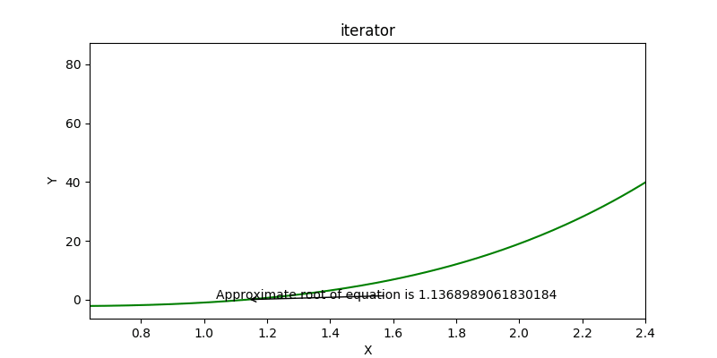
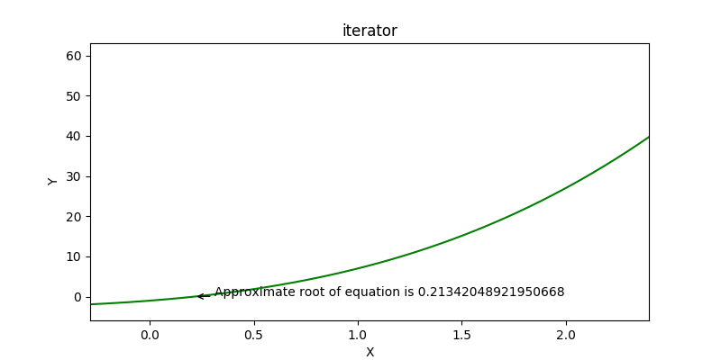
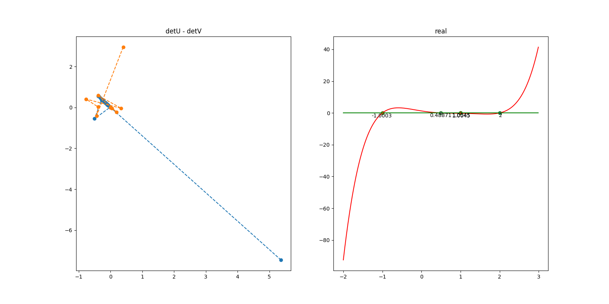

# 数值分析作业
## 环境要求
* python3.6
* numpy 1.13.3
* matplotlib 2.1.0
## 第一次作业
1. [二分法](./第一次作业/dichotomy.py)  
   
2. [试位法](./第一次作业/testpositionmethod.py)
   
## 第二次作业
1.[迭代法](第二次作业/迭代法/fixedPointIteration.py)  
    
2.[牛顿法](第二次作业/牛顿法/newtonIterator.py)  
    
3.[弦截法](第二次作业/弦截法/secantMethod.py)  
    
## 第三次作业
[贝尔斯托法](./第三次作业/bairstow.py)
