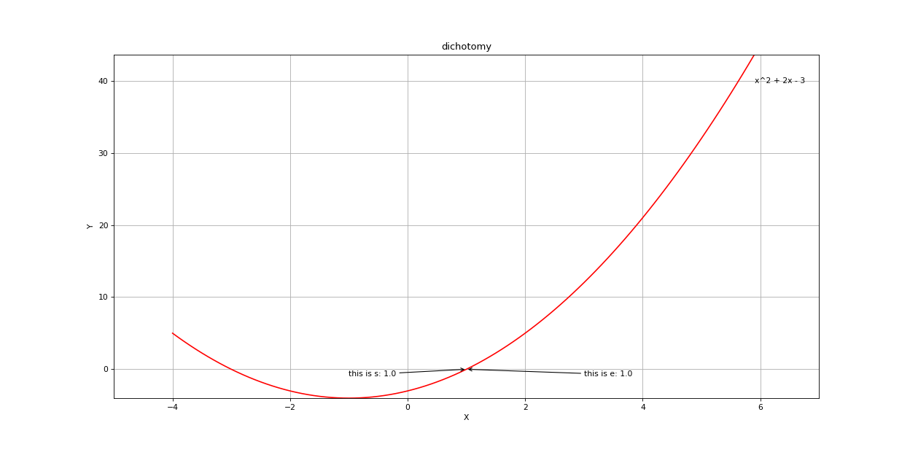

# 数值分析第一次作业
## 二分法
### 二分法定义
对于区间[a，b]上连续不断且f（a）·f（b）<0的函数y=f（x），通过不断地把函数f（x）的零点所在的区间一分为二，使区间的两个端点逐步逼近零点，进而得到零点近似值的方法叫二分法。关于二分法详细介绍可以查看[百度百科](https://baike.baidu.com/item/%E4%BA%8C%E5%88%86%E6%B3%95/1364267?fr=aladdin)
### 二分法流程图

### 二分法关键部分代码
```python3
while True:
            if self.max_steps and i > self.max_steps:
                self.plot(fun,s,e,funname)
                break
            if self.limit_dis and abs(e - s) < self.limit_dis:
                self.plot(fun,s,e,funname)
                break
            m = (s + e) / 2
            if abs(fun(m)) - 1e-6 < 0:
                s = m
                e = m
                self.plot(fun,s,e,funname)
                break
            if fun(m) * fun(s) < 0:
                e = m
            else:
                s = m
```
详细代码[点击这里](./dichotomy.py)
### 二分法运行效果


## 试位法
### 试位法介绍
试位法是计算作为一个方程的根的未知量的一种方法，是先做出一个或者一些估计，再从这个或者这些估计出发并根据未知量的性质求出代求的未知量。试位法类似于二分法，也是将含根区间逐渐缩小，但它并不是单一的二分区间，而是利用区间两个端点的线性插值来求一个近似根。详细介绍可以参考[百度百科](https://baike.baidu.com/item/%E8%AF%95%E4%BD%8D%E6%B3%95/2043048?fr=aladdin)
### 试位法流程图

### 试位法关键代码
```python3
while True:
            if self.max_steps and i > self.max_steps:
                self.plot(fun,s,e,funname)
                break
            if self.limit_dis and abs(e - s) < self.limit_dis:
                self.plot(fun,s,e,funname)
                break
            m = (s*fun(e) - e*fun(s)) / (fun(e) - fun(s))
            if abs(fun(m)) - 1e-6 < 0:
                s = m
                e = m
                self.plot(fun,s,e,funname)
                break
            if fun(m) * fun(s) < 0:
                e = m
            else:
                s = m
```
详细代码[点击这里](testpositionmethod.py)
### 试位法结果
