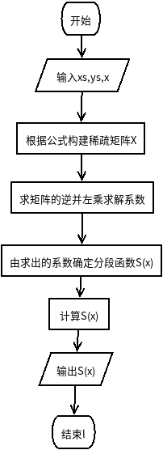
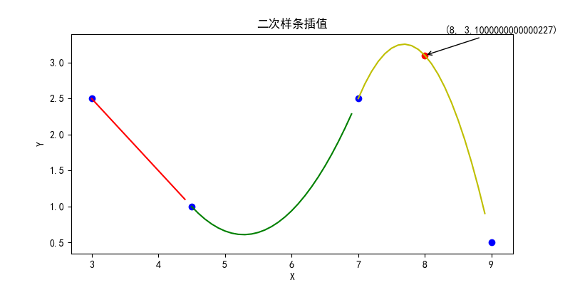

# 数值分析第其次作业
## 二次样条插值
### 二次样条插值流程图

### 关键代码  
```python
n = len(xs) - 1
X = np.matrix(np.zeros((3*n, 3*n)))
for i in range(n):
    X[i, i*3:i*3+3] = [xs[i]**2, xs[i], 1]

    X[i+1, i*3:i*3+3] = [xs[i+1]**2, xs[i+1], 1]
for i in range(n - 1):
    X[i+n+1,i*3:i*3+3]=[xs[i+1]**2, xs[i+1], 1]

for i in range(n - 1):
    X[i+2*n, i*3:i*3+6] = [2*xs[i+1], 1, 0, -2*xs[i+1], -1, 0]

X[-1,0] = 1
Y = ys + ys[1:-1] + [0]*n
Y = np.array(Y).reshape(-1, 1)
Y = np.matrix(Y)
return X.I * Y
```
**详细代码[点这里](./spline2interpolation.py)**
### 效果图

