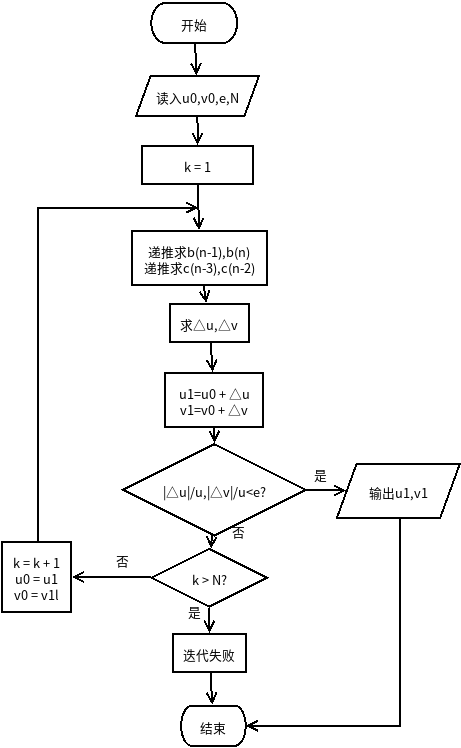

# 数值分析第三次作业
## 贝尔斯托法求多项式根
### 关键代码
```python
detU = []
        detV = []
        i = 0
        while True:
            i += 1
            b = self.getBN(fl, u0, v0)
            c = self.getCN(b, u0, v0)
            r0 = b[-2]
            r1 = b[-1] + u0 * r0
            s0 = c[-2]
            s1 = c[-1] + u0 * s0
            '''
            r0 + c1 * detU + c2 * detV = 0
            r1 + c3 * detU + c4 * detV = 0
            '''
            c1 = u0 * s0 - s1
            c2 = -s0
            c3 = v0 * s0
            c4 = -s1
            detU.append((c2 * r1 - c4 * r0)/(c1 * c4 - c2 * c3))
            detV.append((c1 * r1 - c3 * r0)/(c2 * c3 - c1 * c4))
            u0 += detU[-1]
            v0 += detV[-1]

            if abs(detU[-1]) < e and abs(detV[-1]) < e:
                # x1 = .5 * (-u0 + np.sqrt(u0 ** 2 - 4 * v0))
                # x2 = .5 * (-u0 - np.sqrt(u0 ** 2 - 4 * v0))
                self.detUs.append(detU)
                self.detVs.append(detV)
                x = np.roots([1, u0, v0])
                print("x = ",x)
                self.x.append(x)
                break

            if i > self.iters:
                print('迭代失败,可以尝试增大迭代次数')
                break
```
**详细代码[点这里](./bairstow.py)**
### 流程图

### 结果图
