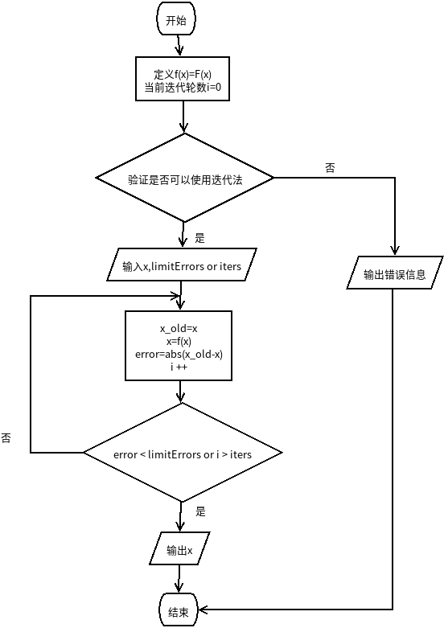
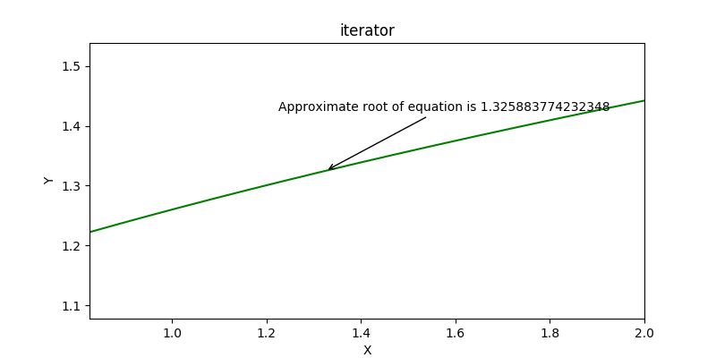

# 数值分析第二次作业
## 定点迭代法
### 关键代码
```python
while True:
    i += 1
    x_b = x
    x = func(x)
    error = x_b - x
    xSet.append(ySet[-1])
    ySet.append(ySet[-1])
    xSet.append(xSet[-1])
    ySet.append(func(xSet[-1]))
    if limitError and error < limitError:
        self.plot(func,xSet,ySet,funcName = funcName)
        break

    elif self.iters and i > self.iters:
        self.plot(func, xSet, ySet,funcName = funcName)
        break
```
**详细代码[点这里](./定点迭代法/fixedPointIteration.py)**
### 流程图

### 结果图
