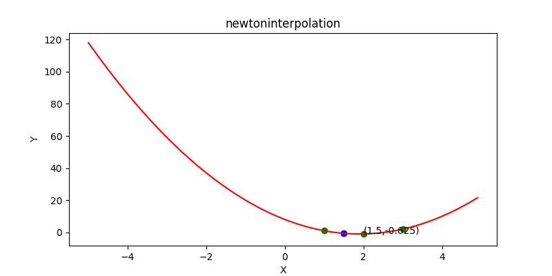
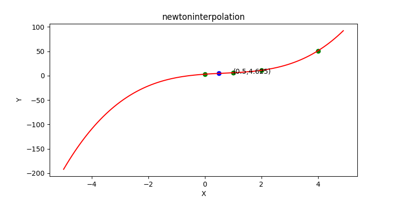

# 数值分析第五次作业
## 牛顿插值法
### 流程图

### 关键代码
```python
    def f(self, x, fx):
        assert type(x) == list
        assert type(fx) == list
        assert len(fx) == len(x)
        if len(x) == 1:
            return fx[0]
        rs = (self.f(x[:-1], fx[:-1]) - self.f(x[1:], fx[1:])) / (x[0] - x[-1])
        return rs
```
详细代码[点这里](./newtoninterpolation.py)
### 结果图
**曲线为拟合曲线**

