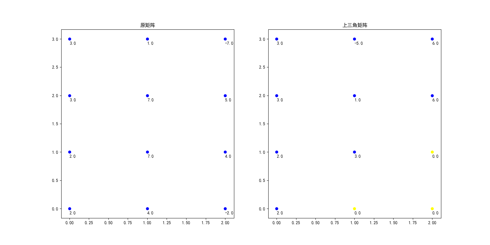

# 数值分析第八次作业
## 高斯消去
### 高斯消去流程图

### 关键代码  
```python
N = min(m, n)
if m > n:
    X[n:m]=0
for i in range(1, N):
    for j in range(i, N):
        try:
            c = X[j, i-1]/X[i-1, i-1]
            X[j] -= X[i-1]*c
        except:
            raise ZeroDivisionError('除数为0,不能进行高斯消去')
```
**详细代码[点这里](./gausselimination.py)**
### 效果图

