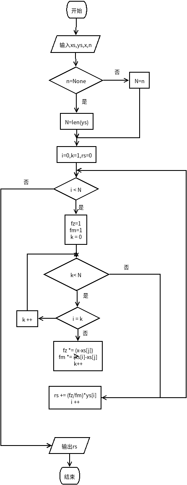
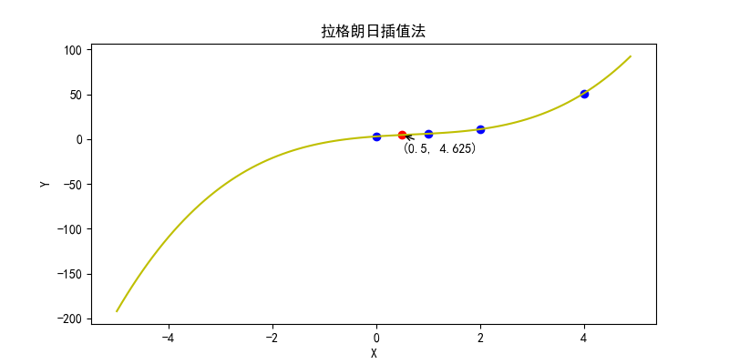
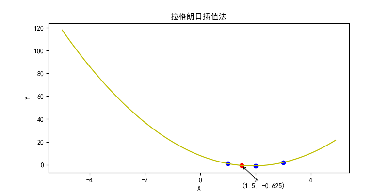

# 数值分析第六次作业
## 拉格朗日插值法
拉格朗日差值多项式表达式:  
  
  
**详细介绍[点击这里](https://baike.baidu.com/item/%E6%8B%89%E6%A0%BC%E6%9C%97%E6%97%A5%E6%8F%92%E5%80%BC%E6%B3%95/9301667?fr=aladdin)**  
## 关键代码  
```python
N = n if n else len(ys)
rs = 0
for i in range(N):
    fz = 1
    fm = 1
    for j in range(N):
        if j == i:
            continue
        fz *= (x - xs[j])
        fm *= (xs[i] - xs[j])
    rs += (fz/fm)*ys[i]
```
**详细代码[点这里](./lagrangeinterpolation.py)**
## 流程图  

## 效果图

