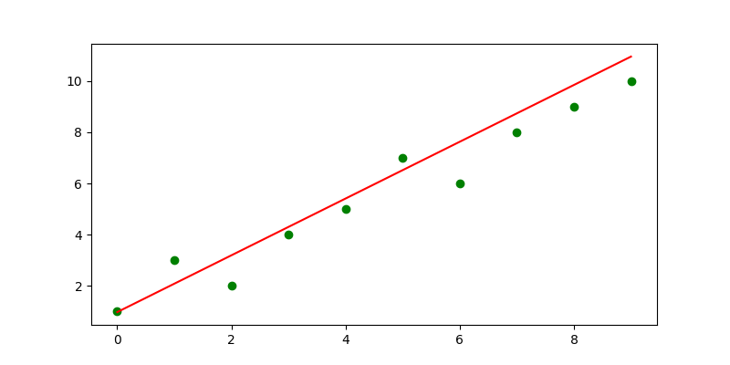

# 最小二乘法
## 公式形式  
$$y=a_0+a_1x+e$$  
则误差为:
$$e=\sum_{i=0}^n(y_i-a_0-a_1x_i)^2$$  
令:
$$\begin{cases}
{\partial{e} \over \partial{a_0}}=-2\sum_{i=0}^n(y_i-a_0-a_1x_i)=0\\\
{\partial{e}\over\partial{a_1}}=2\sum_{i=0}^n(y_i-a_0-a_1x_i)(-x_i)=0\\\
\end{cases}$$
解之可得:
$$\begin{cases}
a_0={n\sum_{i=0}^nx_iy_i-\sum_{i=0}^nx_i\sum_{i=0}^ny_i \over n\sum_{i=0}^nx_i^2-(\sum_{i=0}^nx_i)^2}\\\
a_1={\sum_{i=0}^nx_i^2\sum_{i=0}^ny_i - \sum_{i=0}^nx_i\sum_{i=0}^nx_iy_i \over n\sum_{i=0}^nx_i^2-(\sum_{i=0}^nx_i)^2}\\\
\end{cases}$$
## 运行结果图

***当前只实现部分,下面会继续上传***